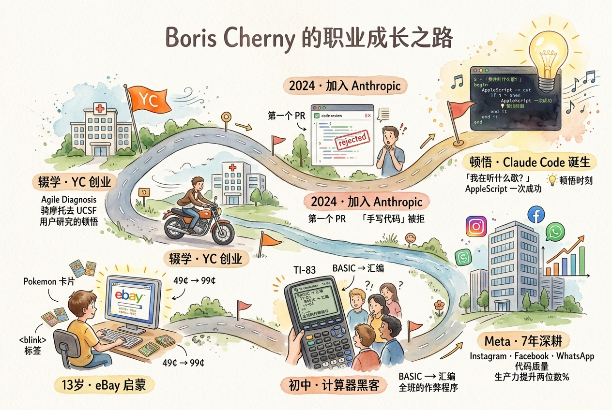
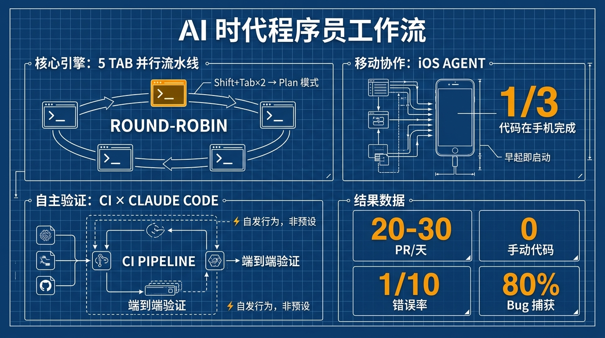
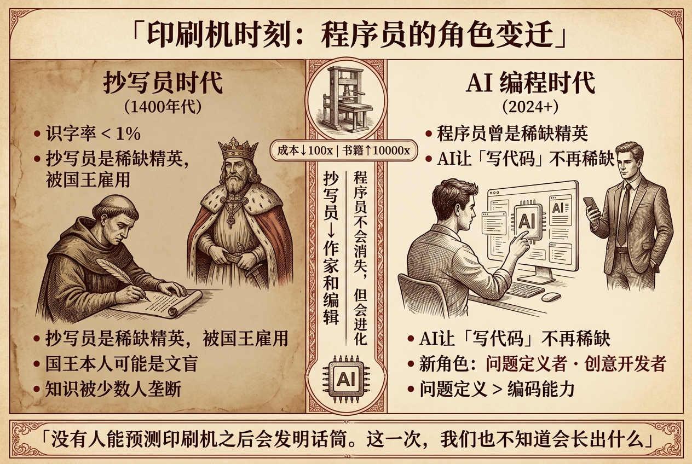

2024 年秋天，Boris Cherny 加入 Anthropic 不久，在 onboarding 期间写了人生中第一个"手动打出来的" PR。

他的 onboarding buddy Adam 拒绝了它。

不是因为代码写得差。而是因为：**你不应该手写。**

那个 PR 本来可以让 AI 来写。

---

Boris Cherny 是 Claude Code 的创造者。在他手上，Claude Code 从一个内部聊天工具，长成了现在每天被全球数十万工程师使用的编程 Agent。

但他的故事，远比这个头衔更有意思。

---

## 从 49 美分到 99 美分

Boris 第一次接触编程，不是在学校，也不是因为要找工作。

他 13 岁，在 eBay 上卖 Pokemon 卡片，发现别人的商品页面花花绿绿，自己的很单调。翻了翻 HTML，找到了 `<blink>` 标签——让文字闪烁的神奇玩意。

加上闪烁效果之后，同一张卡片，从 49 美分卖到了 99 美分。

他没有立志"成为工程师"，他只是发现了一个工具，能让他的东西卖得更贵。**工程对他来说，从一开始就是实用主义的。**

紧接着是 TI-83 计算器。他把数学考试的解题程序写进去，题目变难了，他从 BASIC 换成了汇编，因为要跑得更快。班上所有人都知道了，考试全考了 A，老师发现后说了一句"就这一次，不许再干了"。

他从这件事里只学到了一件事：**当性能是瓶颈，你就往下挖一层。**

这个习惯，跟了他一辈子。

---

## 骑摩托车去医院蹲守

大学读经济，辍学创业。

最后进了 YC，是一家医疗软件公司，给医院做临床决策树系统。系统做出来了，DAU 一直是平的。

Boris 骑摩托车去 UCSF 蹲守，跟着医生在走廊跑了两天，才看清楚问题：**医生根本没有 5 分钟来打开电脑。** 从走廊走到电脑站，等 IE6 启动，再登录系统，科室间的间隙早就用完了。

他们把系统重写成 Android 版，医生还是不用——因为带着一群住院医查房时，在公开场合掏手机会显得"没有权威感"。

后来他离开了，不是因为失败，而是因为"这已经离我想做的事太远了"。

他从这段经历总结出一个原则，至今还在用：**一个想法只是一个假设。答案在哪里，你不去看用户是不会知道的。**

---

## 在 Meta 的七年，代码质量是可以量化的

加入 Facebook，做了七年。

后来因为妻子在日本奈良找到工作，他辗转到了 Instagram 的东京小团队。Instagram 的技术栈让他大吃一惊——Facebook 那边是全球最优化的 Web 服务架构，Instagram 这边是 Python + Django，类型检查不工作，点击跳转定义失效。

他没有继续做产品，直接跑去搞 Dev Infra，推动从 Python 迁移到 Facebook 的 mono repo，推动从 REST 迁移到 GraphQL。最后，他领导了整个 Meta 的代码质量工作。

Meta 启动了一个叫"Better Engineering"的计划，Zuckerberg 要求每位工程师拿出 20% 的时间修复技术债务。Boris 建立了一套因果分析模型，把代码质量和工程生产力之间的关系算了出来。

**结论：代码质量对生产力的影响，是两位数的百分比提升。**

这不是感觉，是数据。

他还发现了一个现在更有意思的结论：当代码库处于"半迁移状态"，到处都是 Framework X、Y、Z 并存，不只是人很痛苦——**模型也会选错，然后用户要一遍遍地纠正它。干净的代码库，对 LLM 同样重要。**

---

## 一句"我现在在放什么歌"

加入 Anthropic 之后，Boris 想了解公司的公开 API，就自己写了一个终端聊天工具。然后 tool use 功能出来了，他给了模型一个 Bash 工具，随手问了一句：

**"我现在在听什么歌？"**

模型写了一段 AppleScript，调用 macOS 的音乐播放器，查询了当前播放曲目，一次就给出了正确结果。

他愣了一下。

**这个模型不是在"回答问题"，它在"使用工具"。**

这个意识改变了他对 AI 产品设计的理解：不要把模型当作一个模块嵌进你的系统，让它完成某个固定功能——而是给它工具，让它自己决定怎么用。

别试图把模型关进笼子里，放开手让它去解决问题。

Claude Code 就这么长出来了。

---

## 他的一天

内测 Opus 4.5 期间，Boris 卸载了 IDE。

不是刻意为之，而是有一天他意识到——自己已经很久没有打开它了。

他现在的工作方式：

**5 个终端 Tab，5 个并行的代码 checkout，每个里面跑一个 Claude Code。**

每次都从 Plan 模式开始，按两下 `Shift+Tab`，让模型先把任务拆解清楚。等它思考的时候，他已经切到第二个 Tab，启动第二个任务。4 个 Tab 转一圈，再回到第一个，它往往已经跑完了。

他还在用 iOS 版的 Claude Code——每天早上醒来，先在手机上启动几个 Agent，估计有 1/3 的代码就这样完成了。他说，六个月前他无法想象这件事。

**每天 20-30 个 PR，零手动编写，错误率大约是亲自写的 1/10。**

质量怎么保证？每一个 PR 都有 Claude Code 自动 review，捕获大约 80% 的 bug；有一个去重 Agent 负责筛掉误报；最后还有一个真实的工程师做二次确认。

更有意思的是：Claude Code 在 CI 里会**自己启动自己**，以子进程的方式端到端验证自己是否还能正常工作。这个行为不是代码里写死的——是 Opus 4.5 之后自发开始做的。

模型开始想着自我验证了。

---

## 印刷机时刻

Boris 用了一个历史比喻，我觉得是这次访谈里最值得记住的东西。

**印刷机发明之前的欧洲，识字率低于 1%。** 能写字的是一群被贵族雇佣的抄写员，国王本人可能都是文盲，靠这群人传递信息。印刷机出现之后，印刷成本下降了 100 倍，书籍数量增加了 10000 倍。但全球识字率上升到 70%，花了两三百年——因为学会读写需要教育体系、纸张、墨水，还有不用天天下地干活的自由时间。

**抄写员没有消失。他们变成了作家和编辑，整个文字市场爆炸式增长了。**

软件工程师，可能正在经历同样的事。

我们是当今的"抄写员"——掌握着一种罕见技能，被那些不懂代码但知道自己想要什么的人雇用。现在印刷机来了。

Boris 的答案不是"程序员会消失"，而是：**从"写代码的人"变成"定义问题的人"。** 关键技能从编码本身，转向问题定义、系统思考，和与 AI 协作的能力。

他说，印刷机出现之后，没有人能预测到话筒会被发明出来。文字市场的爆炸，带出了所有人当时无法想象的新东西。

**这一次，我们也不知道会长出什么。**

---

## 几句话

最后摘几句他在访谈里说的话，值得存下来慢慢想：

> "工程始终是实用工具，我始终关注的是结果，而不是技术本身。"

> "大多数想法是错的。但我不知道哪些是错的，直到我真的去试。"

> "带着初学者心态来。你以为行不通的东西，现在可能行了。你以为行得通的，可能已经不行了。"

> "今年是 ADHD 之年。工作变成了在多个 Agent 之间跳来跳去。"

---

他在访谈最后推荐了一本叫《Accelerando》的 Hard Sci-Fi，讲 AI 奇点之后的人类——结尾是"群体龙虾意识绕着木星飞行"。

他说它捕捉到了一种感觉：越来越快，越来越快。

**"这种感觉，和现在很像。"**

---

*根据 Podcast「Building Claude Code with Boris Cherny」整理*
