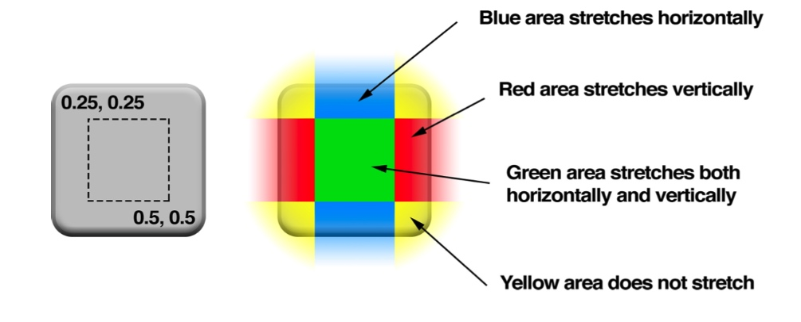
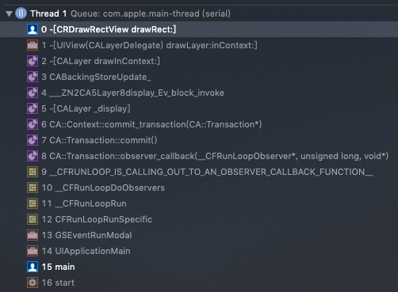

> 本文是我阅读书籍《iOS CORE ANIMATION ADVANCED TECHNIQUES》的读书笔记，感谢原书作者及译者的分享！
> 推荐大家有时间可以读读原书，写的很精彩。[中文版](https://zsisme.gitbooks.io/ios-/content/index.html)

## 一、Core Animation定义

什么是`Core Animation`，相信很多同学对于它既熟悉又陌生，从名字上来看它应该是一个做动画的框架，其实动画只是它的一部分，它曾经叫做`Layer Kit`。

引用书中的定义：

> Core Animation是一个复合引擎，它的职责就是尽可能快地组合屏幕上不同的可视内容，这个内容是被分解成独立的`Layer`，并存储在`Layer Tree`中。于是这个树形成了UIKit以及在iOS应用程序当中你所能在屏幕上看见的一切的基础。

看完还是一脸懵逼？没关系，在这一系列文章中，我将抽丝剥茧，带领大家揭开`Core Animation`的神秘面纱。

## 二、UIView 与 CALayer

我们平时开发中，接触最多的就是 `UIView`，`UIView` 可以处理触摸事件，可以支持基于 `Core Graphics` 绘图，可以做仿射变换（例如旋转或者缩放），或者简单的类似于滑动或者渐变的动画。

`CALayer` 则是更底层的东西，`UIView` 其实就是对 `CALayer` 的高级封装。每个`UIView`都包含一个`CALayer`实例，也就是所谓的`backing layer`。`CALayer` 与 `UIView` 最大的区别是它不处理用户的交互，它的职责是负责屏幕上的显示和动画。`UIView`负责处理用户交互，并管理`CALayer`。

还有一个很重要的点，直接使用 `CALayer` 不能用自动布局，需要自己计算布局。所以一般我们不会直接使用 `CALayer`。除非一些比较特殊的需求：

* 写跨平台的代码，同时兼容 iPhone 和 Mac
* 直接使用 `CALayer` 的子类，实现特殊图层图层的展示
* 对于性能要求很高

> 为什么苹果不直接用一个简单层级来处理所有事情？
> 原因在于要做职责分离，这样也能避免很多重复代码。在iOS和Mac OS两个平台上，事件和用户交互有很多地方的不同，基于多点触控的用户界面和基于鼠标键盘有着本质的区别，这就是为什么iOS有`UIKit`和`UIView`，但是Mac OS有`AppKit`和`NSView`的原因。他们功能上很相似，但是在实现上有着显著的区别。

### CALayer独有功能

苹果官方为我们封装好了 `UIView`，简单易用却抛弃了灵活性，难免会有 `UIView` 满足不了的需求，这是就需要我们直接使用 `CALayer` 了。有一些UIView没有暴露出来的CALayer的功能：

* 阴影，圆角，带颜色的边框
* 3D变换
* 非矩形范围
* 透明遮罩
* 多级非线性动画

## 三、backing image

`backing image` 是 `CALayer` 的重要部分，通过它可以实现各种复杂的UI。有两种设置 `backing image` 的方法:
1. 设置CALayer的 `contents` 属性
2. 直接用 `Core Graphics` 绘制

### 3.1、contents

CALayer有一个属性叫做 `contents` ，这个属性的类型被定义为id，但是，如果你给`contents`赋的不是CGImage，那么你得到的图层将是空白的。

> `contents` 这个奇怪的表现是由 Mac OS 的历史原因造成的。它之所以被定义为 id 类型，是因为在 Mac OS 系统上，这个属性对 CGImage 和 NSImage 类型的值都起作用。如果你试图在iOS平台上将 UIImage 的值赋给它，只能得到一个空白的图层。

我们先来看一个 Demo，如何用 `UIView` 而不是 `UIImageView` 加载了一张图片。

```objc
- (void)viewDidLoad {
    [super viewDidLoad];
    
    self.view.backgroundColor = [UIColor lightGrayColor];
    UIView *view = [[UIView alloc] initWithFrame:CGRectMake(0, 0, 100, 100)];
    view.backgroundColor = [UIColor whiteColor];
    view.center = self.view.center;
    [self.view addSubview:view];
    CALayer *layer = [CALayer layer];
    [view.layer addSublayer:layer];
    layer.frame = CGRectMake(0, 0, 100, 100);
    
    // imageNamed: 会根据不同机型取不同倍图
    UIImage *image = [UIImage imageNamed:@"test"];
    // UIImage转CGImageRef时scale属性丢失
    CGImageRef imageRef = image.CGImage;
    layer.contents = (__bridge id)imageRef;
    // 设置图片缩放
    // 如果contentsGravity设置为自动缩放，可以不用设置这个属性
    layer.contentsScale = image.scale;
    // 设置图片居中不缩放
    layer.contentsGravity = kCAGravityCenter;
}
```

#### 3.1.1、contentsGravity

`UIImageView` 中通过设置 `contentMode` 来设置图片拉伸方式，在 `CALayer` 中有一个对应属性 `contentsGravity`，它是一个NSString类型，默认值是 `kCAGravityResize`。
它的可选的值有：

* kCAGravityCenter
* kCAGravityTop
* kCAGravityBottom
* kCAGravityLeft
* kCAGravityRight
* kCAGravityTopLeft
* kCAGravityTopRight
* kCAGravityBottomLeft
* kCAGravityBottomRight
* kCAGravityResize
* kCAGravityResizeAspect
* kCAGravityResizeAspectFill

#### 3.1.2、UIImage转CGImage拉伸丢失问题

和UIImage不同，CGImage没有拉伸的概念。使用UIImage类去读取图片的时候，它会读取了屏幕（1x、2x、3x）对应尺寸的图片。但是用CGImage来设置`layer.contents`时，拉伸这个因素在转换的时候就丢失了，不过我们可以通过手动设置`contentsScale`来修复这个问题。

#### 3.1.3、contentsScale

`contentsScale` 定义了像素点与 view 的尺寸的比例，如果 `contentsScale` 设置为1.0，将会以每个点1个像素绘制图片，如果设置为2.0，则会以每个点2个像素绘制图片。它的默认值是1.0。`UIView`中对应`contentScaleFactor`属性。

#### 3.1.4、masksToBounds

当图片内容超出 `UIView` 尺寸时，通过设置 `clipsToBounds` 可以定义是否裁剪内容，`CALayer` 对应的属性就是 `masksToBounds`。


#### 3.1.5、contentsCenter

contentsCenter是一个CGRect，它定义了一个固定的边框和一个在图层上可拉伸的区域。类似于`UIImage`里的`resizableImageWithCapInsets` 方法，只是它可以运用到任何`backing image`，甚至包括`Core Graphics`绘制的图形。



### 4.1、Custom Drawing

第二种方案是直接用 `Core Graphics` 绘制  `backing image`，具体实现方式是通过继承 `UIView` 并实现 `drawRect` 来自定义绘制。

#### 4.1.1、CALayerDelegate

要理解 `drawRect` 的工作原理，首先我们来看看 `CALayerDelegate`。
`CALayer` 有一个可选的delegate，通过实现 `CALayerDelegate`，就可以自定义 `CALayer` 的 `backing image`。
`CALayerDelegate` 中有两个值得关注的方法：

```objc
// 由-display方法的默认实现调用，你应该实现整个显示过程（通常通过设置'contents'属性）
// 如果实现了该方法，就不会调用drawLayer:inContext:了
- (void)displayLayer:(CALayer *)layer;

// 由-drawInContext方法的默认实现调用
// 如果没有实现displayLayer:，就会调用该方法
- (void)drawLayer:(CALayer *)layer inContext:(CGContextRef)ctx;
```

给个简单的Demo：

```objc
- (void)viewDidLoad {
    [super viewDidLoad];
    self.view.backgroundColor = [UIColor lightGrayColor];
    UIView *view = [[UIView alloc] initWithFrame:CGRectMake(0, 0, 100, 100)];
    view.backgroundColor = [UIColor whiteColor];
    view.center = self.view.center;
    [self.view addSubview:view];
    
    CALayer *layer = [CALayer layer];
    [view.layer addSublayer:layer];
    layer.frame = CGRectMake(0, 0, 100, 100);
    // 设置代理
    layer.delegate = self;
    // display方法必须手动调用，不然不会执行绘制
    [layer display]; 
}

- (void)drawLayer:(CALayer *)layer inContext:(CGContextRef)ctx {
    // 画一个圆环
    CGContextSetLineWidth(ctx, 10);
    CGContextSetStrokeColorWithColor(ctx, [UIColor redColor].CGColor);
    CGContextStrokeEllipseInRect(ctx, layer.bounds);
}
```

> 需要注意的是，`[layer display]`需要手动调用，`CALayer`不会自动重绘它的内容，而是把重绘决定权交给了开发者。

#### 4.1.2、drawRect

理解了 `CALayerDelegate` 再来看 `drawRect` 就简单很多了，`UIView` 把 `CALayerDelegate` 设置为自己，并实现了 `displayLayer:`，我们不再需要关心这些细节，只需要重写 `drawRect`，在方法内绘制 `backing image` 即可。

**drawRect调用时机**

当 `UIView` 在屏幕上出现的时候，`drawRect` 方法就会被自动调用。然后内容就会被缓存起来直到它需要被更新，通常是因为手动调用了`setNeedsDisplay`，或影响到表现效果的属性值被更改时，如 bounds 属性。

需要注意的是，调用 `setNeedsDisplay` 后，不会马上触发 `drawRect`，而是要等到接收到RunLoop的 `kCFRunLoopBeforeWaiting` 通知后触发 `drawRect`，如下图所示。



**如非必须，勿重写drawRect！！！**

`drawRect` 方法没有默认的实现，因为对UIView来说，`backing image` 并不是必须的。如果`UIView` 检测到 `drawRect` 方法被调用了，它就会为视图分配一个 `backing image`，这个`backing image` 的像素尺寸等于`视图大小 * contentsScale`；反之则不会创建 `backing image`，因此如果没有自定义绘制的任务就不要在重写一个空的 `drawRect`。

> 在做实验的时候发现了一个有趣现象，在同一个RunLoop循环里，先调用`setNeedsDisplay`，再设置 `view.layer` 的 `contents`，系统就不会调用 `drawRect` 方法了(难道是因为设置`contents`会把`needsDisplay`设置为NO？？)。

## 四、小结

如果我们只是写一些简单的界面，用 `UIView` 这种高级接口就够了。但是为了实现复杂UI与丝滑体验，使用 `Core Animation` 就是一个很好的选择（缺点是门槛高点，编码复杂度要高些）。
本文要点总结如下：

1. `Core Animation`是一个负责处理图层、屏幕绘制、动画等的复合引擎
2. `UIView` 是对 `CALayer` 的高级封装，每个 `UIView` 包含一个 `CALayer` 实例。
3. 设置 `CALayer` 的 `backing image` 有两种方式：
    * 直接设置 `contents` 属性
    * 实现 `drawRect` 方法，用 `Core Graphics` 绘制