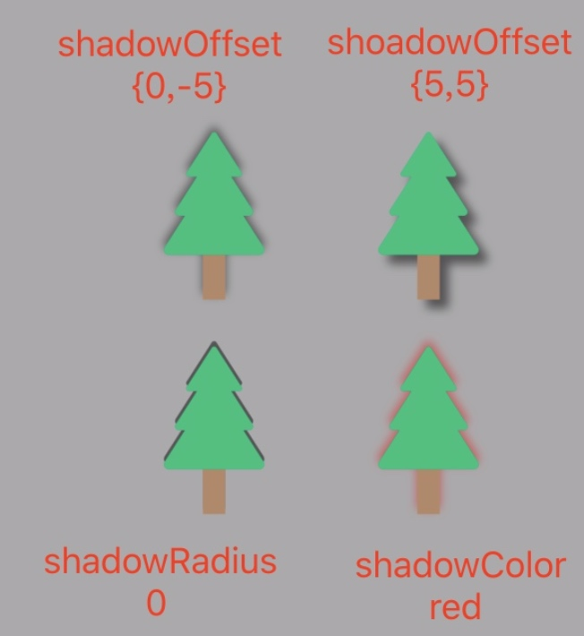

我们在之前的文章中讨论了`CALayer`的`backing images`与几何布局，这篇文章我们来看看如何通过它的特性来实现一些炫酷的效果。

## 圆角与边框

`conrnerRadius` 属性控制图层角的曲率。它是一个浮点数，默认为0（为0的时候就是直角）。`conrnerRadius` 只影响背景色而不影响 `backing image` 和 `sublayers`。如果把 `masksToBounds` 设置成YES，图层里面的所有东西都会被截取。
`CALayer`另外两个非常有用属性就是`borderWidth`和`borderColor`。二者共同定义了图层边的绘制样式。这条线（也被称作stroke）沿着图层的bounds绘制，同时也包含图层的角。
`borderWidth`是以点为单位的定义边框粗细的浮点数，默认为0。`borderColor`定义了边框的颜色，默认为黑色。

需要注意的是，`conrnerRadius`与`masksToBounds`同时使用是会造成离屏渲染，使用需要谨慎。例如在TableView的cell实现圆角头像，使用这种方案实现圆角就不合适了。有一种简单的替代方案：利用一张中间为透明圆形的图片来进行遮盖，虽然会引起blending，但性能仍然高于离屏渲染。


## 阴影

与圆角和边框不同，阴影会根据`backing image`与子视图来绘制，而不是layer的边界和角半径。
自定义阴影主要有下面属性需要关注（配合下图的例子看着比较直观）：
* shadowOpacity：阴影的透明度，取值范围在0.0（不可见）到1.0（不透明）之间
* shadowColor：阴影颜色，默认是黑色
* shadowOffset：阴影的方向和距离，他是一个CGSize，宽度控制阴影横向位移，高度控制阴影纵向位移。它的默认值是{0, -3}，也就是说阴影向上便宜3个点。
* shadowRadius：阴影的模糊度，默认值是3。




### shadowPath

需要注意的是使用`shadowOffse`设置阴影会导致离屏渲染，实时计算阴影是一个非常消耗资源的操作，尤其是图层有多个子图层，且每个图层还有一个有透明效果的`backing images`的时候。
这时可以通过设置`shadowPath`属性来提高性能，`shadowPath`是一个`CGPathRef`类型（一个指向`CGPath`的指针）。`CGPath`是一个`Core Graphics`对象，用来指定任意的一个矢量图形。我们可以通过这个属性单独于图层形状之外指定阴影的形状。下图可以清晰的看到两种方式在性能上的差距。


下面的代码实现了一个自定义的矩形阴影。


```objc
    // 设置阴影颜色
    layer.shadowColor = [UIColor blackColor].CGColor;
    // 设置阴影不透明度
    layer.shadowOpacity = 0.5;
    // 绘制一个矩形
    CGMutablePathRef path = CGPathCreateMutable();
    CGPathAddRect(path, NULL, layer.bounds);
    CGPathRelease(path);
    // 自定义矩形阴影
    layer.shadowPath = path;
```

## 拉伸

当图片实际大小与要展示的大小不同的时候，图像就需要缩放。有两个属性可以定义属性缩放使用的算法：
* minificationFilter：缩小图片使用算法，默认`kCAFilterLinear`
* magnificationFilter：放大图片使用算法，默认`kCAFilterLinear`

CALayer提供了三种缩放的方式：

* kCAFilterLinear：双线性过滤算法，默认算法
* kCAFilterTrilinear：三线性过滤算法
* kCAFilterNearest：临近过滤算法

关于什么是线性过滤算法，可以看看维基百科的相关词条[维基百科-双线性过滤](https://zh.wikipedia.org/wiki/双线性过滤)。这里摘录一段供参考：

> 双线性过滤（Bilinear filtering）是进行缩放显示的时候进行纹理平滑的一种纹理过滤方法。 在大多数情况下，纹理在屏幕上显示的时候都不会同保存的纹理一模一样，没有任何损失。正因为这样，所以一些像素要使用纹素之间的点进行表示，在这里我们假设纹素都是位于各个单元中心或者左上或者其它位置的点。双线性过滤器利用像素所表示点周围四个最近的点（纹素点）之间进行双线性插值。
在纹理缩减到一半或者放大一倍的范围内，双线性过滤都能够有非常好的精度。这也就是说，如果纹理在每个方向都有 256 个像素，那么将它缩减到 128 以下或者放大到 512 以上的时候，由于会丢掉太多的像素或者进行了过多的平滑处理，纹理看起来就会很差。
三线性过滤尽管比较复杂，但是可以使得过渡非常平滑。

临近过滤算法是一种简单粗暴的方法，它只取样最近的单像素点，不管其它像素点。这样做非常快，也不会使图片模糊。但是会让压缩的图片更糟，让放大的图片显得块状或是马赛克严重。

对比线性过滤和临近过滤算法，非常小的图像或具有鲜明对比度和较少斜线的较大图像（例如，计算机生成的图像）​​，临近过滤算法将保持对比度并且可以产生更好的效果。但是对于大多数图像，尤其是具有斜线或曲线的图像，线性过滤算法好得多。换句话说，线性过滤保留了形状，临近过滤保留了像素差异。

书中举了两个很直观例子，对于大图来说，双线性过滤算法和三线性过滤算法表现得更出色：


对于没有斜线的小图来说，最近过滤算法要好很多：


## 小结

`CALayer`提供了一系列方法来实现常见的视觉效果，但是在使用的时候我们要注意离屏渲染问题。