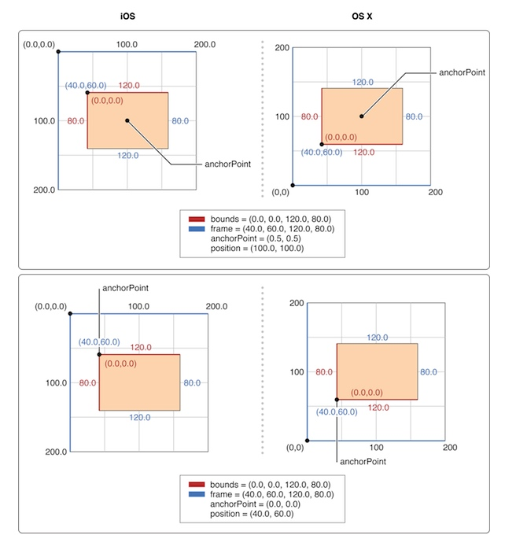

## 一、Layout

UIView有三个比较重要的布局属性：`frame`，`bounds`和`center`，`CALayer`对应地叫做`frame`，`bounds`和`position`。
`frame`是图层在父图层上的坐标，`bounds`是内部坐标（{0, 0}通常是左上角）。
`center`和`position`要难理解一些，简单来说他们定义了`anchorPoint`在父图层中的位置（后面会详细说明）。

`UIView` 的 `frame`,`bounds`,`center` 属性其实只是存取方法，改变这三个属性其实实质上是改变 `CALayer` 的对应属性。下图是一个例子：


`frame` 是一个虚拟属性，是根据 `bounds`，`position` 和 `transform` 计算而来，所以当其中任何一个值发生改变，`frame` 都会变化。相反，改变 `frame` 的值同样会影响到他们当中的值。

> `frame` 与 `bounds` 一直相等吗？这是一个面试常问到的问题。
> 我们通常开发的时候`frame`与`bounds`的宽高都相等。但是当对图层做变换的时候（旋转或者缩放），`frame` 实际上代表了覆盖在图层旋转之后的整个轴对齐的矩形区域，这时候它们将不再相等。如下图所示。


## 二、anchorPoint、position、center三者不得不说的故事

要彻底理解 `position` 究竟是什么，首先我们得搞懂什么是 `anchorPoint`。它可以理解为一个固定图层的图钉，它的主要作用是作为变换的支点，比如在旋转图层时，就会以 `anchorPoint` 为圆心旋转（一起来想象一下）。


`anchorPoint` 用相对坐标表示，它表示相对于图层的位置，举几个例子。
* 左上角：(0,0)
* 右下角：(1,1)
* 中心：(0.5,0.5)

> 需要注意的是 `anchorPoint` 可以放到 layer 外面，设置大于1或小于0的值就行。

而 `position` 就表示 `anchorPoint` 在父图层的坐标，下面这张图非常的清晰明了。



由于 `anchorPoint` 是 `CALayer` 的属性，默认值是(0.5,0.5)，也就是中心。而 `UIView` 没有这个属性，因此 `UIView` 的 `center` 属性就表示view的中心点在父view的坐标（命名为center可以说是非常的直观）。

## 三、Coordinate Systems

### 3.1、坐标系转换

`CALayer` 给不同坐标系之间的图层转换提供了一些工具类方法，这些方法可以把定义在一个图层坐标系下的点或者矩形转换成另一个图层坐标系下的点或者矩形。

```objc
- (CGPoint)convertPoint:(CGPoint)point fromLayer:(CALayer *)layer;
- (CGPoint)convertPoint:(CGPoint)point toLayer:(CALayer *)layer;
- (CGRect)convertRect:(CGRect)rect fromLayer:(CALayer *)layer;
- (CGRect)convertRect:(CGRect)rect toLayer:(CALayer *)layer;
```

### 3.2、翻转

常规说来，在iOS上，一个图层的`position`位于父图层的左上角，但是在Mac OS上，通常是位于左下角。`Core Animation`可以通过`geometryFlipped`属性来适配这两种情况，它决定了一个图层的坐标是否相对于父图层垂直翻转，是一个BOOL类型。在iOS上通过设置它为YES意味着它的子图层将会被垂直翻转，也就是将会沿着底部排版而不是通常的顶部（它的所有子图层也同理，除非把它们的`geometryFlipped`属性也设为YES）。

### 3.3、Z 轴

和 `UIView` 严格的二维坐标系不同，`CALayer` 存在于一个三维空间当中。除了我们已经讨论过的 `position` 和 `anchorPoint` 属性之外，`CALayer` 还有另外两个属性，`zPosition` 和 `anchorPointZ`，二者都是在Z轴上描述图层位置的浮点类型。

## 四、Hit testing

`CALayer` 并不关心事件响应链，所以不能直接处理触摸事件或者手势。但是它有一系列的方法帮你处理事件：`containsPoint:`和`hitTest:`。
`containsPoint:` 接受一个在本图层坐标系下的CGPoint，如果这个点在layer的frame范围内就返回YES。
`hitTest:` 方法接受一个CGPoint类型参数，它返回这个点所在layer，也就是layer本身，或者叶子节点。

## 自动布局

`CALayer` 不支持自动布局，需要手动管理和计算。最好的管理时机是 `CALayerDelegate` 的方法 `layoutSublayersOfLayer:` ，这个方法自动调用当 `bounds` 变化或者 `setNeedsLayout` 被调用。

然后手动管理布局非常的不友好，这是一个为什么不直接用 `CALayer`，而是要用 `UIView` 的重要原因。

## 小结

1. 理解`frame`，`bounds`，`center`，`position`，`anchorPoint` 对于理解图层布局很重要。
2. `CALayer` 没有处理事件响应链，需要手动处理。
3. `CALayer` 不支持自动布局。

## 参考文章

[这将是你最后一次纠结position与anchorPoint！](http://kittenyang.com/anchorpoint/)
