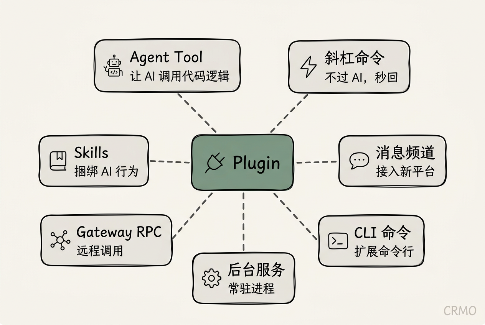
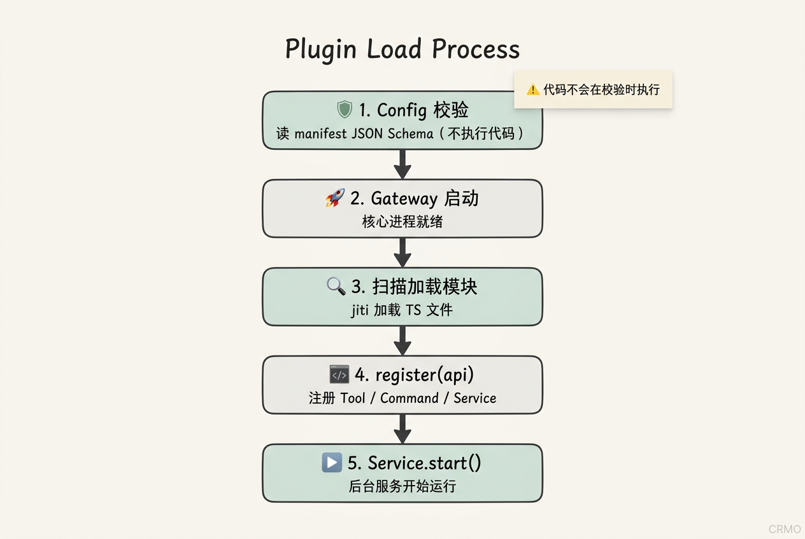
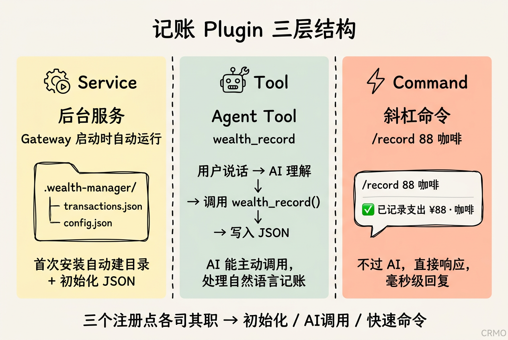
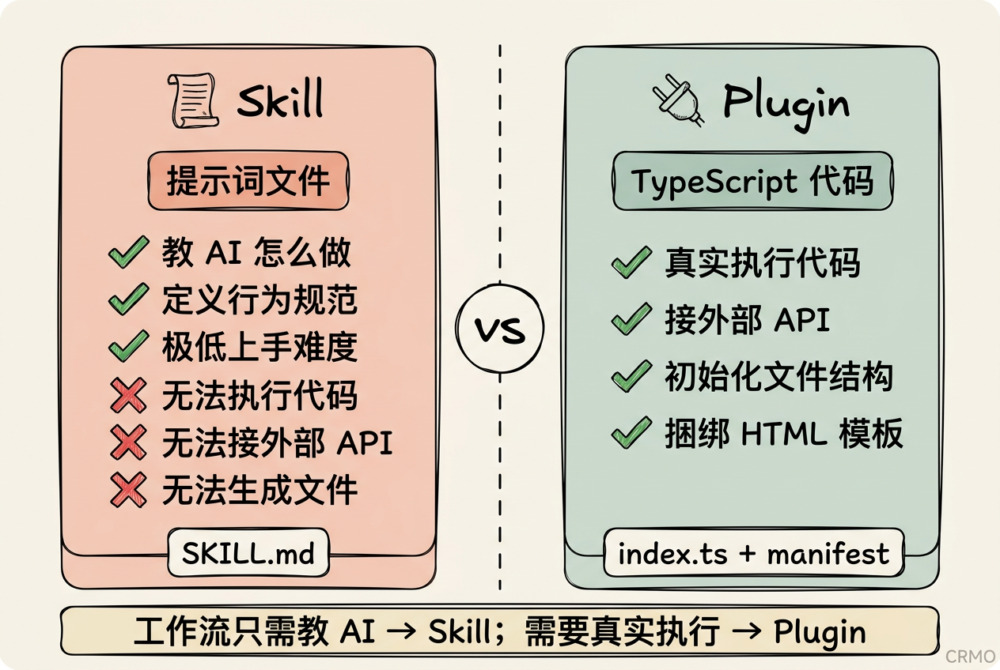

> OpenClaw 不只是一个 AI 助手框架，它是一个可以无限扩展的平台。Plugin 系统是这个平台最核心的扩展机制。



## 为什么需要 Plugin？

用过 OpenClaw 一段时间之后，你大概会遇到这个问题：内置的工具不够用了。

比如你想接入一个自定义的数据源，比如你想让 AI 记住某种特定的操作流程，比如你想把一套工作流打包分享给别人用。

这时候 Skill（一个 SKILL.md 提示词文件）已经不够用了。你需要真正的代码。

**Plugin 就是为这个场景设计的。**

## Plugin 能做什么？

一个 Plugin 可以给 OpenClaw 注册以下七种能力：

- **Agent Tool（工具函数）** — 让 AI 能调用你写的代码逻辑，比如读写本地文件、调外部 API、做数据计算
- **斜杠命令（Auto-reply Command）** — 不经过 AI，直接执行。`/record 88 咖啡` 这种秒回的命令就靠这个实现
- **消息频道（Channel）** — 接入一个新的聊天平台，微信个人号、Matrix、自定义 Webhook 都可以做成频道 Plugin
- **CLI 命令** — 扩展 `openclaw` 命令行，比如 `openclaw wealth report`
- **后台服务（Service）** — 跟随 Gateway 启动的常驻进程，适合做初始化、监听、定时任务
- **Gateway RPC** — 给 Gateway 注册远程调用方法，供外部系统触发
- **Skills** — Plugin 可以捆绑 SKILL.md，告诉 AI 在什么时候用这个 Plugin 的工具

## Plugin 的架构原理

### 运行位置

Plugin 运行在 **Gateway 进程内部**，不是沙箱，不是子进程。这意味着：

- 它拥有完整的 Node.js 能力（文件系统、网络、原生模块）
- 它和 Gateway 共享内存，性能极好
- 但也意味着：**你只应该装你信任的 Plugin**

### 发现机制

OpenClaw 按优先级扫描以下位置，先发现的同 ID Plugin 胜出：

```
1. config 里 plugins.load.paths 指定的路径
2. <workspace>/.openclaw/extensions/
3. ~/.openclaw/extensions/          ← 最常用
4. 内置 extensions（默认关闭）
```

### 加载流程

```
Config 校验（读 manifest JSON Schema）
    ↓
Gateway 启动
    ↓
扫描并加载 Plugin 模块（jiti 加载 TS）
    ↓
执行 register(api) 注册各种能力
    ↓
Service.start() 启动后台服务
```

> **重要**：Config 校验**不执行 Plugin 代码**，只读 manifest 里的 JSON Schema。这是一个安全设计——即使 Plugin 代码有问题，配置校验也不会受影响。



### Manifest 是核心

每个 Plugin 的根目录必须有 `openclaw.plugin.json`，没有就不加载：

```json
{
  "id": "wealth-manager",
  "name": "财富管理",
  "description": "记账、统计、生成报表",
  "version": "1.0.0",
  "configSchema": {
    "type": "object",
    "additionalProperties": false,
    "properties": {
      "dataDir": { "type": "string" },
      "currency": { "type": "string" }
    }
  },
  "uiHints": {
    "dataDir": { "label": "数据目录", "placeholder": "~/.wealth-manager" },
    "currency": { "label": "货币单位", "placeholder": "CNY" }
  },
  "skills": ["./skills"]
}
```

`configSchema` 定义了用户在 config 里能填什么，`uiHints` 控制 UI 里字段的显示。

## Plugin API 速查

Plugin 的入口导出一个接收 `api` 的函数：

```ts
export default function register(api) {
  // 在这里注册所有能力
}
```

`api` 提供以下核心方法：

| 方法 | 用途 |
|------|------|
| `api.registerTool(schema, options?)` | 注册 Agent Tool |
| `api.registerCommand(options)` | 注册斜杠命令 |
| `api.registerService({ id, start, stop })` | 注册后台服务 |
| `api.registerChannel({ plugin })` | 注册消息频道 |
| `api.registerGatewayMethod(name, handler)` | 注册 Gateway RPC |
| `api.registerCli(fn, options)` | 注册 CLI 命令 |
| `api.registerHook(event, handler, meta)` | 注册生命周期 Hook |
| `api.logger` | 日志工具 |
| `api.config` | 当前完整 config |
| `api.runtime.tts / .stt` | 核心 TTS / STT 服务 |

## 实战：做一个记账 Plugin

用一个具体案例把上面的概念串起来。

**目标功能：**

- 用自然语言或斜杠命令记账（`/record 88 咖啡`）
- AI 能查询、统计收支
- 每周 / 月自动生成 HTML 报表
- 首次安装自动初始化目录和数据文件

### 目录结构

```
wealth-manager/
├── openclaw.plugin.json
├── index.ts
├── tools/
│   ├── record.ts       ← 写入一笔交易
│   ├── query.ts        ← 查询/统计
│   └── report.ts       ← 生成 HTML 报表
├── templates/
│   ├── monthly.html    ← 月报模板（内嵌 Chart.js）
│   └── weekly.html
├── skills/
│   └── wealth-manager/
│       └── SKILL.md    ← AI 行为指南
└── package.json
```

### 数据模型

数据存在 `~/.wealth-manager/transactions.json`，结构极简：

```json
[
  {
    "id": "uuid-xxx",
    "date": "2026-03-08",
    "amount": 88,
    "type": "expense",
    "category": "餐饮",
    "description": "午餐"
  }
]
```

### 核心代码



**三个关键注册点：**

```ts
export default function register(api) {
  const cfg = api.config?.plugins?.entries?.["wealth-manager"]?.config ?? {};
  const dataDir = cfg.dataDir ?? path.join(process.env.HOME!, ".wealth-manager");

  // 1. 后台服务：启动时自动初始化目录和文件
  api.registerService({
    id: "wealth-init",
    start: () => {
      if (!fs.existsSync(dataDir)) fs.mkdirSync(dataDir, { recursive: true });
      api.logger.info(`[wealth-manager] 数据目录：${dataDir}`);
    },
    stop: () => {},
  });

  // 2. Agent Tool：让 AI 能调用记账逻辑
  api.registerTool({
    name: "wealth_record",
    description: "记录一笔收入或支出",
    parameters: Type.Object({
      amount:      Type.Number(),
      type:        Type.Union([Type.Literal("expense"), Type.Literal("income")]),
      category:    Type.String(),
      description: Type.String(),
    }),
    async execute(_id, params) {
      const result = await recordTransaction(dataDir, params);
      return { content: [{ type: "text", text: JSON.stringify(result) }] };
    },
  });

  // 3. 斜杠命令：不过 AI，直接写入
  api.registerCommand({
    name: "record",
    acceptsArgs: true,
    handler: async (ctx) => {
      const [amountStr, ...desc] = (ctx.args ?? "").trim().split(/\s+/);
      const amount = parseFloat(amountStr);
      if (isNaN(amount)) return { text: "❌ 格式错误，例：/record 88 午餐" };
      await recordTransaction(dataDir, {
        amount, type: "expense", category: "其他", description: desc.join(" ")
      });
      return { text: `✅ 已记录支出 ¥${amount} · ${desc.join(" ")}` };
    },
  });
}
```

### 报表 HTML 模板

模板内嵌 Chart.js，无需后端服务，直接双击打开：

```html
<!DOCTYPE html>
<html>
<head>
  <meta charset="utf-8">
  <title>{{PERIOD}} 财务报告</title>
  <script src="https://cdn.jsdelivr.net/npm/chart.js"></script>
</head>
<body>
  <h1>{{PERIOD}} 财务报告</h1>
  <p>总支出：<strong>¥{{TOTAL_EXPENSE}}</strong> / 总收入：<strong>¥{{TOTAL_INCOME}}</strong></p>
  <canvas id="chart"></canvas>
  <script>
    const data = {{CHART_DATA}};
    new Chart(document.getElementById('chart'), {
      type: 'doughnut',
      data: { labels: data.labels, datasets: [{ data: data.values }] }
    });
  </script>
</body>
</html>
```

Tool 读取 `transactions.json` → 计算统计 → 替换模板占位符 → 写出 HTML 文件。

## 定时核算怎么做

Plugin 本身**不需要内置定时逻辑**。正确姿势是装完 Plugin 后，让 AI 帮你建 Cron：

```
每周日 22:00 → 生成本周财务报告发到 Discord
每月  1 日 09:00 → 生成上月财务总结
```

**Plugin 提供能力，Cron 提供时机，职责分离。**

## 安装和分发

```bash
# 本地开发调试（软链，改代码立刻生效）
openclaw plugins install -l ./wealth-manager
openclaw gateway restart

# 发布到 npm
npm publish --access public
openclaw plugins install @yourname/wealth-manager

# 发布到 ClawhHub（社区市场）
clawhub publish
clawhub install yourname/wealth-manager
```

## Skill vs Plugin：怎么选？



| | Skill | Plugin |
|---|:---:|:---:|
| 本质 | 提示词文件 | TypeScript 代码 |
| 能执行代码 | ❌ | ✅ |
| 能接外部 API | ❌ | ✅ |
| 能初始化文件结构 | ❌ | ✅ |
| 能捆绑 HTML 模板 | ❌ | ✅ |
| 上手难度 | 极低 | 中等 |

一句话：工作流只涉及「教 AI 怎么做」→ Skill 就够。需要真实执行代码、管理数据、生成文件 → 必须是 Plugin。

---

Plugin 系统最吸引人的地方不是它的 API 有多复杂，而是**它足够简单**。

一个 `openclaw.plugin.json` + 一个导出函数的 TS 文件，你就拥有了和内置功能几乎对等的权限。配合 Skill 定义 AI 行为，配合 Cron 驱动时机，一套完整的自动化工作流就成型了。

而这套工作流，可以打包、发布、让任何人一行命令安装。

这才是真正意义上的「AI 工作流分享」。
