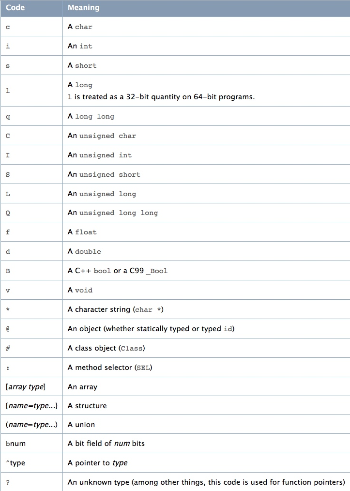

> [本文 Demo 地址](https://github.com/crmo/BFSSearchClass) 
> 2018.7.31

## 需求

在开发功能时，为了满足产品变态的需求，难免有系统类提供的API不够用的时候，这时候私有变量就可以发挥它光和热了。怎么通过一个类，一层一层的找到特定类型的私有成员变量？
受益于Objective-C的动态语言特性，就算苹果`UIKit`不开源，但是在runtime面前，类的结构还是暴露无遗。我的思路是逐层手动打印成员变量信息，如果是UI控件可以用Reveal来加快进度，配合KVC机制，获取私有变量就如同探囊取物一般。
在多次遇到这个问题后，我决定实现一个工具类来简化这个过程，毕竟能自动化的就尽量不要手动。

## 思路

> 搜索范围：成员变量、属性

关键步骤如下：

1. runtime中的方法`class_copyIvarList()`，可以取出类的所有成员变量结构体`Ivar`。
2. 从Ivar中可以取出成员变量类型`Type Encodings`
3. 用`Type Encodings`获取到类名
4. 遍历类的所有`Ivar`，获取到类的所有成员变量的类信息

但是问题没这么简单，比如ClassA是ClassB的成员变量，ClassB是ClassC的成员变量，想通过ClassC找到ClassA，需要向下找两层才能找到，还要考虑父类的情况。
整个搜索过程就是一颗以待搜索类为根的树，可以用BFS来搜索，步骤如下（如图，数字是搜索顺序）：
1. 从根节点开始搜索
2. 首先遍历当前节点的父类，加入搜索队列
3. 再取出当前节点的所有成员变量，加入搜索队列

## 如何从Ivar中获取Class

Ivar中不能直接取出对应类名，只能取出`Type Encodings`，间接可以得到类名。从[官方文档](https://developer.apple.com/library/archive/documentation/Cocoa/Conceptual/ObjCRuntimeGuide/Articles/ocrtTypeEncodings.html)截了张图，可以清晰的看到Code的定义。

基本数据类型、id类型、集合类型、结构体等类型就不需要搜索了，可以过滤掉。我们只搜索两种类型

1. 类，例如`@"UIWebViewInternal"`
2. 代理，例如`@"<UIViewControllerTransitioningDelegate>"`

## 优化及存在问题

1. 可以用一个`NSMutableSet`存储已经搜索过的类，每次搜索前判断一下是否已经搜索过
2. 记录搜索次数，可以限制搜索次数。
3. 对于定义为id类型、集合类的成员变量没有做处理，可以继续深入遍历

---

[流程示意图源文件](%E6%B5%81%E7%A8%8B%E7%A4%BA%E6%84%8F%E5%9B%BE.graffle)