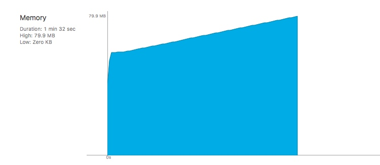

> 2018.7.18

今天在学习大佬博客的时候看到一个问题，下面代码会有什么问题？

```objectivec
    // largeNumber是一个很大的数
    for (int i = 0; i < largeNumber; i++) {
        NSString *str = [NSString stringWithFormat:@"hello -%04d", i];
        str = [str stringByAppendingString:@" - world"];
        NSLog(@"%@", str);
    }
```

刚开始没看出什么问题，就是普通的循环，每次循环创建一个局部变量`NSString`。于是写了个Demo验证了下，在观察内存的时候发现了端倪，在循环过程中，内存不断飙升。



顿时明白了，原来问题的关键就是这个`largeNumber`，当循环此时很大时，就会创建大量的局部变量，而且得不到释放，于是内存就爆了。这时候就该`@autoreleasepool`上场了，优化后代码：

```objectivec
    for (int i = 0; i < largeNumber; i++) {
        @autoreleasepool {
            NSString *str = [NSString stringWithFormat:@"hello -%04d", i];
            str = [str stringByAppendingString:@" - world"];
            NSLog(@"%@", str);
        }
    }
```

查看运行内存，可以看到非常平稳。


