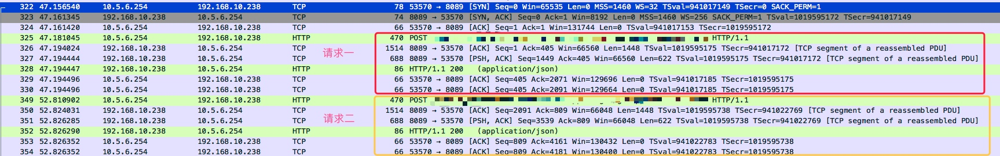

> 2018.8.28

> 本文分析使用代码是[AFNetworking 3.2.1](https://github.com/AFNetworking/AFNetworking/releases)

最近使用`Instruments`中的`Leaks`分析项目内存泄露，发现了一个AFNetworking的循环引用。如下图所示：


通过调用栈发现产生泄露的代码在这里：

```objc
// AFURLSessionManager.m
- (instancetype)initWithSessionConfiguration:(NSURLSessionConfiguration *)configuration {
    // ... 初始化代码，省略

    // 导致循环引用的方法
    self.session = [NSURLSession sessionWithConfiguration:self.sessionConfiguration delegate:self delegateQueue:self.operationQueue];

    // ... 其它初始化代码，省略
    return self;
}
```

大致原因就是AFURLSessionManager引用NSURLSession，同时设置NSURLSession的delegate为自己，NSURLSession会强引用delegate，于是产生了循环引用。

> 关于NSURLSession的delegate官方说明：
> This delegate object is responsible for handling authentication challenges, for making caching decisions, and for handling other session-related events. The session object keeps a strong reference to this delegate until your app exits or explicitly invalidates the session. If you do not invalidate the session, your app leaks memory until it exits.

## 解决方案

在AFNetworking官方issues找到了相关的问题[Possible memory leak in AFURLSessionManager](https://github.com/AFNetworking/AFNetworking/issues/1528)。作者的回答如下：


解决方案有两种：
1. 这是最常见也是作者推荐的方法，只创建一个AFURLSessionManager，整个APP共享，虽然还是有循环引用，但是就没有内存泄露的问题了。
2. 如果要使用多个AFURLSessionManager，在使用完成后手动调用`invalidateSessionCancelingTasks:`来断开循环引用。（这种方案不推荐，具体原因看下一小节）

## AFURLSessionManager复用

关于AFURLSessionManager是否使用单例这个问题，官方demo使用的是单例，在苹果官方文档找到这么一段话

> With the NSURLSession API, your app creates one or more sessions, each of which coordinates a group of related data transfer tasks. For example, if you’re creating a web browser, your app might create one session per tab or window, or one session for interactive use and another for background downloads. Within each session, your app adds a series of tasks, each of which represents a request for a specific URL (following HTTP redirects, if necessary).

我的理解是这样的，根据使用场景的不同，这个问题有不同的答案，在大多数场景下APP都是在和同一服务器打交道，一个`session`就够了，如果有连接多个服务器、或者后台下载等功能需求，可以给每个服务器、后台下载任务创建单独的`session`（但是也不能每个请求都单独创建session）。

在查找资料的时候，我发现有博客提到单例seesion可以减少TCP三次握手，动手验证下：

多个网络请求复用一个`AFURLSessionManager`，连续发两个网络请求，用`Wireshark`抓包可以看到，第二次网络请求复用了第一次的TCP连接，没有做三次握手。



下图是每次网络请求都新建一个`AFURLSessionManager`的抓包，可以看到每个网络请求都进行了TCP三次握手。


实验结果的确如网上所说，复用`AFURLSessionManager`可以减少三次握手，提升效率。
