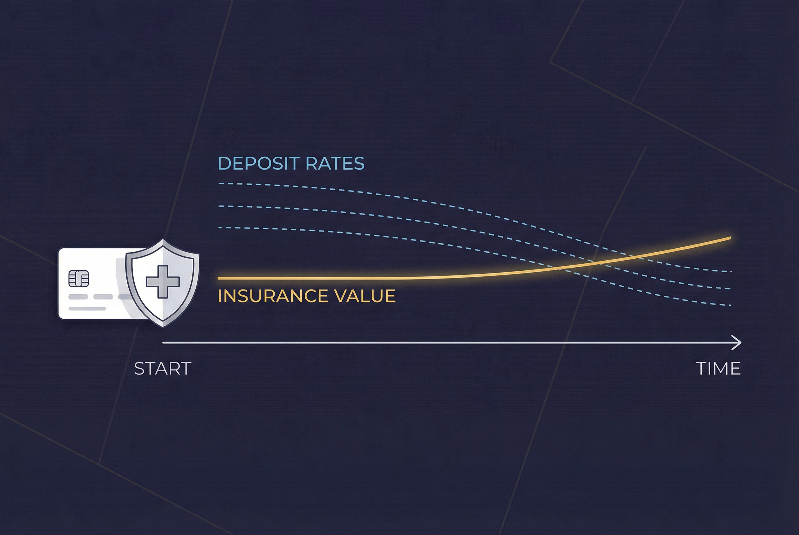
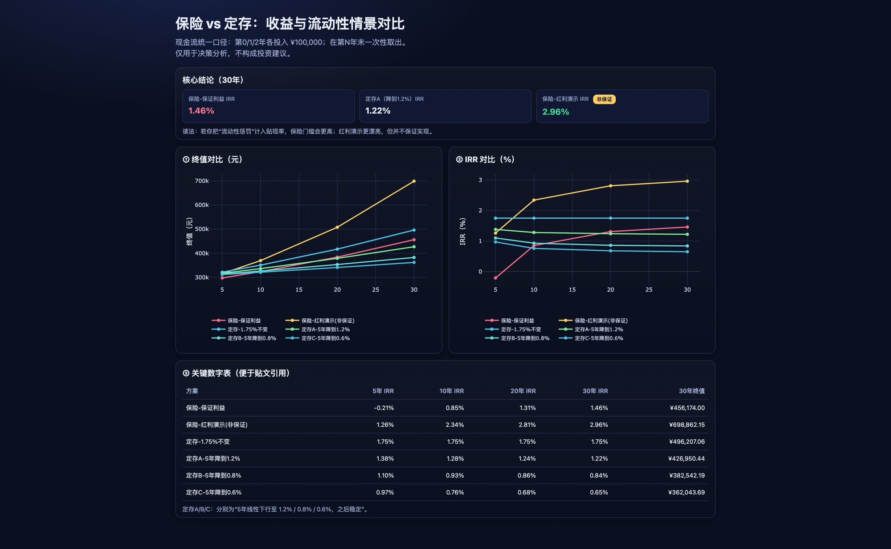

上周银行经理给我推了一款存款保险，说的那句话让我当时说不出反驳：

> "定存利率还会继续降，这款能锁定长期高利率，越早买越合算。"

有道理吗？方向上是有的。  
但我对「讲得头头是道却说不出具体数字」有点过敏 😂

于是我没当场表态——我做了一件更有用的事：**把产品链接发给 Openclaw，让它陪我算清楚。**

从发链接到拿到完整决策建议，大概花了 40 分钟。

这篇文章就是这 40 分钟的全部经过。

---

## 第一件事：先把底层材料全捞出来

产品页底部有行小字：「更多信息可查看《保险条款》《产品说明书》……」

我以前大概率直接忽略，最多扫一眼。

但这次我让 Openclaw 把所有文件都扒出来。它发现这些文档不是干净的 PDF——是分散存在 CDN 的**一张张图片**，按文件类型分开存储。

最终清单：

- 保险条款：10 页
- 产品说明书：7 页
- 投保提示书：3 页
- 投保声明：2 页
- 客户告知书：5 页
- **合计 27 页**

我自己翻？大概率到第 5 页就放弃了。Openclaw 两分钟全部抓齐，OCR 成可读文本。

---

## 第二件事：把「听起来」变成「算出来」

这才是重点。

我问了它一个最直接的问题：

> 「我 3 年每年投 10 万，总共 30 万本金。  
> 第 5 年、第 10 年、第 20 年、第 30 年，按保证利益能拿回多少？IRR 是多少？」

结果出来了——**我第一眼看到保证 IRR，有点愣了**：

| 年限 | 可取保证金额 | IRR（复利年化）|
|------|------------|--------------|
| 5 年  | ¥297,432   | **-0.21%**   |
| 10 年 | ¥323,844   | **0.85%**    |
| 20 年 | ¥383,918   | **1.31%**    |
| 30 年 | ¥456,174   | **1.46%**    |

等等。5 年是**负的**？30 年才到 1.46%？

经理说「高利率」……高在哪里？

Openclaw 解释了根本原因：**经理讲的「利率」和你算的 IRR 不是同一件事。**

三种常见的口径混淆：

1. **单利 vs 复利（IRR）**——单利数字更好看
2. **红利演示 vs 保证利益**——演示值是情景，不是承诺
3. **有效保额增长率 vs 投资回报率**——保额增长 ≠ 你的收益

---

## 第三件事：定存「利率下行」到底有多惨？

经理的核心论点是：定存以后会越来越低。这个方向没错，问题是**低到什么程度才会让保险更合算**？

我让 Openclaw 做了三条情景：

- **情景 A**：5 年内温和降至 1.2%，之后稳住
- **情景 B**：5 年内降至 0.8%
- **情景 C**：5 年内快速降至 0.6%



对比保险保证 IRR 之后，结论是这样：

- **10 年以内**：定存大多数情景都不差，哪怕利率降了
- **20 年以上**：若定存长期稳定在 1% 以下，保险保证口径才开始占优
- **30 年**：优势差距会拉开，但前提是你能真的拿满 30 年

加上红利演示（非保证）的话，长期数字会好看很多——但那是情景，不是承诺。

---

## 结论不是「谁更好」，是「你怎么选」

Openclaw 最后给我的决策建议是三句话：

1. **看持有期**：10 年内流动性很重要，定存更灵活
2. **看利率判断**：你觉得未来利率会降到哪里？1% 以下才对保险有利
3. **红利不能当保底**：演示收益越高，你越要打折看它

这不是「保险好」或「定存好」的结论，而是把决策变量明确化：**你自己对流动性和未来利率的看法，才是答案。**

以前我大概会被「专业感」影响。这次我只看同口径数字，心里很稳。



---

## 整个过程，你只需要问四句话


```
1. 把这个产品的原始条款全部抓出来，给我完整清单。
2. 按我的真实现金流（每年投多少、投几年）统一算 IRR。
3. 把定存利率下行做三种情景，和产品做同口径对比。
4. 给我决策建议：短期 / 长期 / 流动性各怎么考量。
```

不需要懂 IRR 公式，不需要会算现金流，不需要读 27 页条款。

**你只需要知道问什么。**

---

## 为什么我想写这篇

因为如果我自己做这件事——找条款、抄数字、建模型、做情景——大概半天过去，最后还不一定算对。

有了 Openclaw，我更像是多了一个非常贴心的**个人整理师**：

- 它不替我拍板
- 但它能把「看起来很专业」的话术拆成可验证的数字
- 让我在 40 分钟内完成一个理财经理可能永远不会帮你做的分析

这对普通人真的很重要。

不是因为我们不会思考，  
而是我们缺少一个能**把混乱信息整理成清晰决策**的搭子。

现在我有了。

---

*如果你手里也有类似产品，欢迎把链接扔给我——我按同样方法帮你做一版「你自己的决策图」。*
