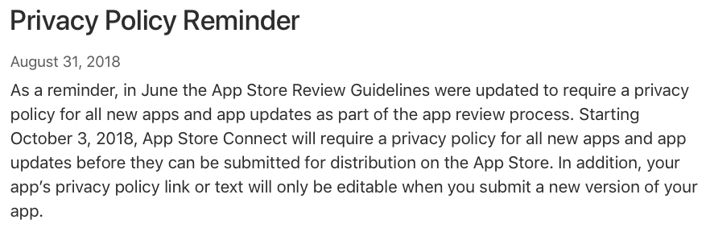
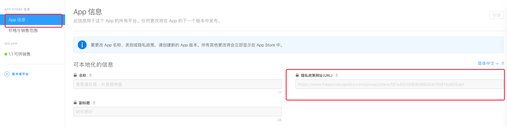

> 2018.10.12

国庆假期回来准备提交新版本到App Store，遇到苹果新政策，实测下来影响不大，应对还算比较简单，总结一下分享给大家。

## 政策说明

从2018年10月3号起，所有新提交的App都必须提供隐私条例，[官方连接](https://developer.apple.com/news/?id=08312018a)。

对于隐私条例，苹果审核条例是这么说明的。

需要在两个地方提供隐私条例：
1. 元数据
2. 应用内有明显的入口

## 生成隐私条例

关于隐私条例，网上有各种模板，弄一个改改就行了，这里推荐一个[自动生成的网站](https://www.freeprivacypolicy.com)。
免费生成，还提供一个链接，挂在它们网站，就不用自己搞服务器了。例如[我给App生成的隐私条例](
https://www.freeprivacypolicy.com/privacy/view/cb2289ee81ec0d2f61ec1790bccf861d)

## 集成隐私条例

第一步：把刚刚生成的URL填在元数据里

第二步：在应用内加一个页面，开一个WebView加载刚刚生成的URL，例如我就放在了“关于-隐私条例”

第三步：提交审核时，在备注里面说明，隐私条例的入口在哪里。（这一步可能不要也行，不过为了稳妥我加上了，给苹果审核团队讲清楚总是好的）

第二天就上架成功了。