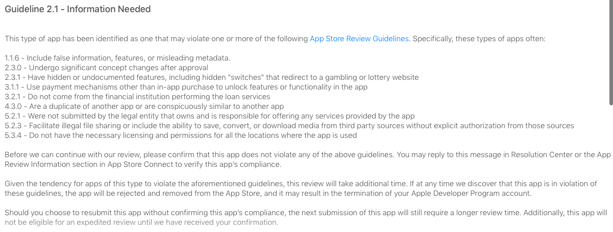

> 2018.10.7

## 写在前面

先说点废话，从事iOS开发以来，一直有一个目标，拥有一个自己的APP上架App Store，并且登上苹果推荐榜单，这可能是大多数iOSer的梦想。在脑子里产生了各种想法，但是发现自己能想到的别人都做了，并且做的很好，加上工作生活上的很多事情（主要是懒😝），一拖就是3年。
后来因为自己的真实需求，App Store找不到能满足需求的产品，就做了一个播放器自己用，在中秋假期狠下心来，买了开发者账号（688，心痛！！就当为了梦想充值吧。），把这个播放器上架了。

## 购买开发者账号

关于怎么买个人开发者账号，网上的教程一抓一大把，整个购买流程也没啥好注意的，根据提示一步一步走就OK了。但是到了最后付款环节把我卡了一周（办了两张信用卡。。。），必须要`visa+银联`双标的信用卡，注意一定要双标，只有visa或者只有银联都不行。
付了款一天左右苹果就会发来邮件，提供身份证正反面照片就可以了。

## 上架App Store

上架流程就轻车熟路了，打包上传、填写各种APP说明、上传图标、宣传图、提交审核。激动的我一晚上没睡好觉，第二天早上打开邮箱，等待我的居然是`2.1大礼包`（Guideline 2.1 - Information Needed）。



一看我就懵逼了，上架这么多次第一次遇到这么严厉的回复，感觉分分钟要被封号。经过多方咨询，发现这是苹果今年新推出的大礼包，很多人都遇到过，一般是机器审核回复的，遇到这种情况别慌（除非你是马甲包、或者抄袭的之类的APP），仔细检查条例，然后逐条答复（最好用英文）。
最后我还录制了一个视频，来演示我的APP的主要功能，上传到`youtube`，附在了备注。
分享下我的答复模板：

```
尊敬的苹果审核团队：
    感谢您的耐心审核，针对下面问题，我们做了详细的检查
    
关于 Guideline 2.1

1.1.6 - “香蕉播放器”没有包含任何的虚假与误导信息，全部都是真实有效的
2.3.0 - “香蕉播放器”没有在通过审核后修改任何概念和功能
2.3.1 - “香蕉播放器”没有包含任何隐藏功能，没有包含赌博、彩票网站
3.1.1 - “香蕉播放器”内没有任何内购、支付功能，所有功能都是免费提供给用户
3.2.1 - “香蕉播放器”内部包含任何贷款等金融服务
4.3.0 - “香蕉播放器”功能都是独立开发，不存在抄袭或者大量相似
5.2.1 - “香蕉播放器”没有法人实体和版权风险
5.2.3 - “香蕉播放器”没有提供文件共享服务，或者其它存在版权问题的音视频
5.3.4 - “香蕉播放器”仅在中国区上架，没有违规内容

关于 Guideline 2.3.7

我已经按照说明，修改了元数据，请审核团队再次审核。

最后再次感谢您辛苦的审核。


Dear Apple Review Team:
    Thank you for your patience review, we have done a detailed check on the following questions.
    
About Guideline 2.1

1.1.6 - "Banana Player" does not contain any false and misleading information, all of which are true and effective
2.3.0 - "Banana Player" does not modify any concepts and features after passing the review
2.3.1 - "Banana Player" does not contain any hidden features, does not contain gambling, lottery sites
3.1.1 - There is no in-app purchase and payment function in the “Banana Player”, all functions are provided to the user free of charge.
3.2.1 - "Banana Player" contains any financial services such as loans
4.3.0 - The "Banana Player" feature is developed independently, without plagiarism or a lot of similarity
5.2.1 - "Banana Player" has no legal entity and copyright risk
5.2.3 - "Banana Player" does not provide file sharing services, or other audio and video with copyright issues
5.3.4 - "Banana Player" is only available in China, no illegal content

About Guideline 2.3.7

I have modified the metadata according to the instructions, please review the team again.

Finally, thank you again for your hard review.
```

第二天审核通过，成功上架！

## 打个广告

> 下载🔗：https://dwz.cn/HvVix2hH

“香蕉播放器”是我独立开发的第一款APP，免费无广告。主要功能在手机上播放从网盘、光盘、网站下载的音频资料、课程、音乐。无需数据线，用Wi-Fi就可以拷贝文件到手机，自动记录播放进度。
如果有需求可以支持一波，有什么问题欢迎联系我。